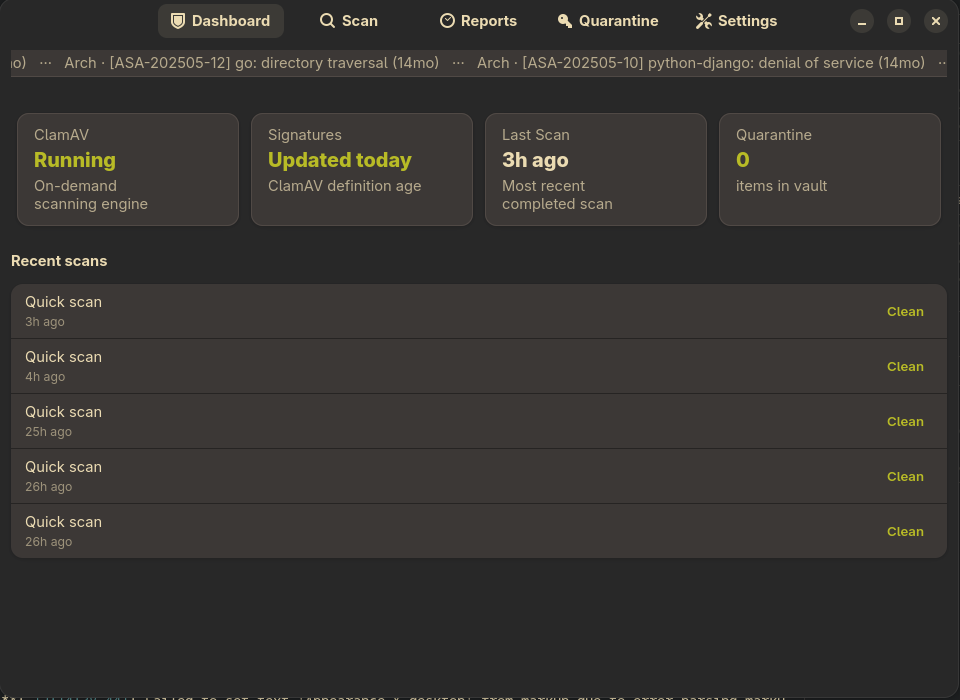
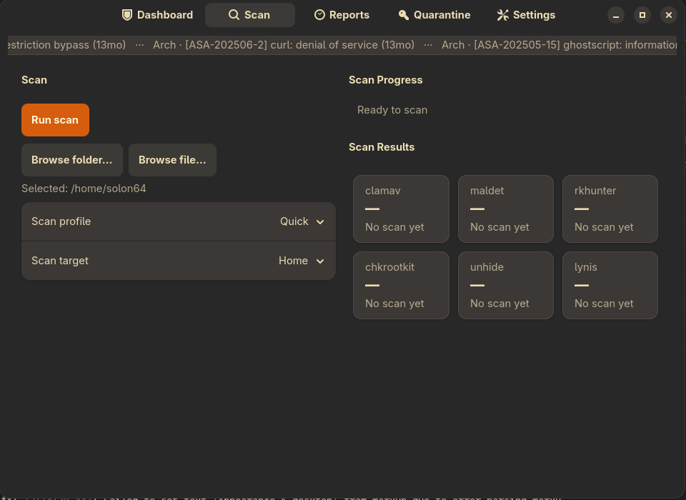
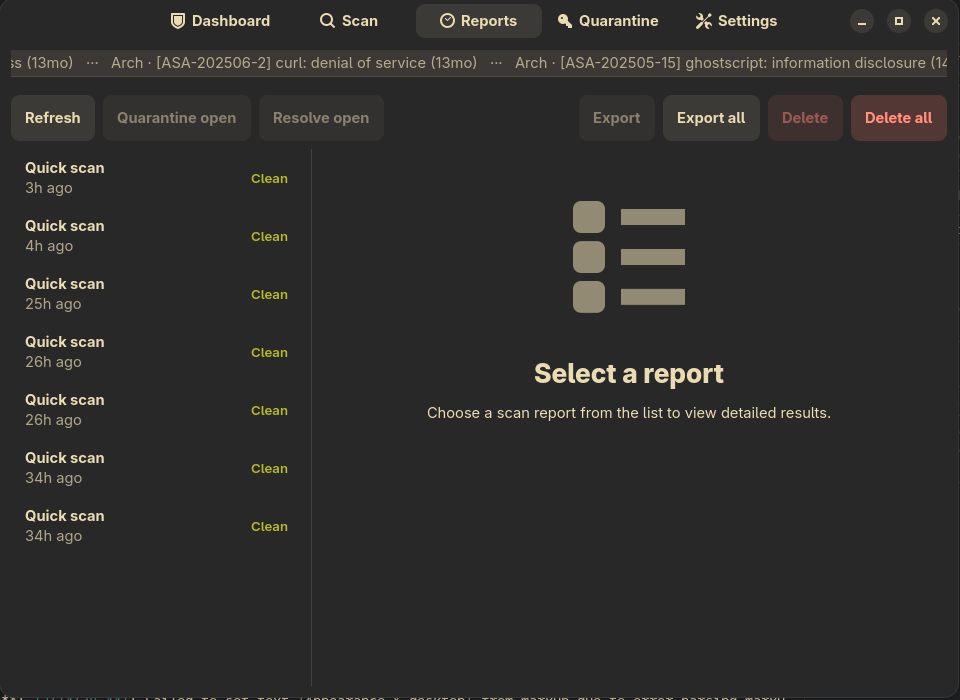
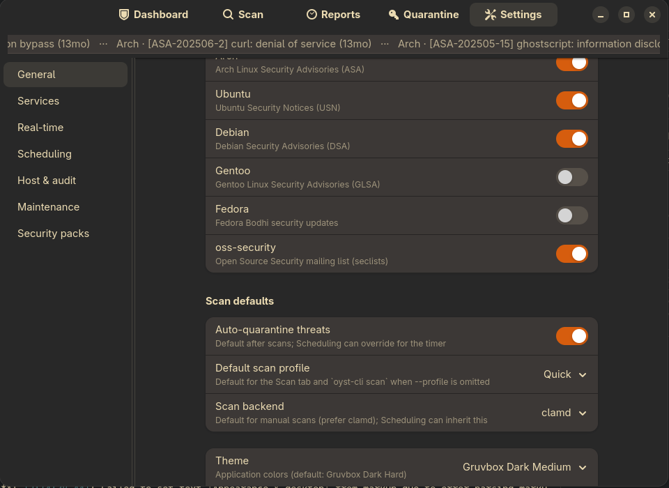

<p align="center">
  
</p>

<h1 align="center">oysterAV</h1>

<p align="center">
  <strong>Linux security orchestrator</strong> — CLI-first backend with a thin GTK4 GUI.<br>
  ClamAV spine, pack adapters, quarantine, scheduling — without reimplementing engines.
</p>

<p align="center">
  <a href="https://github.com/asafelobotomy/oysterAV"></a>
  <a href="LICENSE"></a>
  
</p>

<p align="center">
  
</p>

<p align="center"><em>Dashboard — posture cards, security news ticker, recent scans</em></p>

---

## Why oysterAV?

- **Orchestrator, not engine** — wraps ClamAV, rkhunter, Lynis, and friends ([ADR-001](docs/adr/001-orchestrator-not-engine.md))
- **CLI owns security** — `oyst-cli` is the source of truth; the GUI is a client ([ADR-002](docs/adr/002-cli-first-gui-is-client.md))
- **Full or Lite runtime** — vendored tools under XDG, or host packages only ([ADR-004](docs/adr/004-pack-runtime-delivery.md))
- **Host co-control** — on-access blocking stays with ClamAV; oysterAV guides and responds ([ADR-008](docs/adr/008-clamav-host-cocontrol.md))

## Screenshots

| Scan | Reports |
|:----:|:-------:|
|  |  |
| Profiles, paths, multi-pack progress | History, export, quarantine / resolve actions |

<p align="center">
  <br>
  <em>Settings — feeds, scan defaults, services, scheduling, packs</em>
</p>

## Prerequisites

- Python ≥ 3.12 and [uv](https://docs.astral.sh/uv/)
- GUI: system GTK4 + libadwaita (PyGObject introspection)

## Quick start

```bash
uv sync --extra all
uv run oyst-cli setup run --json
uv run oyst-cli status assess --json
uv run oyst-cli scan ~/Downloads --json
```

`setup run` can take several minutes on a cold machine (signatures / packs). Soft-failed steps (schedule, rkhunter) are non-fatal — check `--json` output.

```bash
./scripts/check.sh --quick   # local validation
```

## GUI

```bash
uv sync --extra gui --extra dev
uv run oysterav
```

The GUI talks only through `OystClient` / `oyst-cli serve` — never runs security tools itself. See [ADR-007](docs/adr/007-gui-remapping-phase.md) and the [GUI↔CLI contract](docs/cli/gui-contract.md).

## Architecture

| Package | Role |
|---------|------|
| `oyst_core` | Packs, orchestrator, quarantine, RPC serve |
| `oyst_cli` | Full CLI (`oyst-cli`) |
| `oysterav` | Thin GTK4 / libadwaita client |

Decision log: [docs/adr/README.md](docs/adr/README.md).

## Pack runtime (Full mode, default)

Vendored upstream tools live under `~/.local/share/oysterav/runtime/`:

```bash
uv run oyst-cli runtime status
uv run oyst-cli runtime install --all
uv run oyst-cli runtime update   # ClamAV CDIFF updates
```

**Lite mode** uses host packages only ([packaging/lite/README.md](packaging/lite/README.md)):

```bash
uv run oyst-cli config set runtime.mode lite
```

## Packs

| Tier | Packs |
|------|-------|
| Required | clamav, freshclam |
| Recommended | rkhunter, chkrootkit, lynis, clamonacc, firewall |
| Optional | maldet, unhide, fail2ban, fangfrisch |

Host package examples (Lite / clamd on the host):

```bash
# Debian/Ubuntu
sudo apt install clamav clamav-daemon rkhunter chkrootkit lynis

# Arch / CachyOS
sudo pacman -S clamav rkhunter chkrootkit lynis

# Fedora
sudo dnf install clamav clamav-update rkhunter chkrootkit lynis
```

On-access prevention with the host: [operator guide](docs/user-guide/clamonacc-prevention.md).

## Health / debug

```bash
uv run oyst-cli doctor --json
uv run oyst-cli status assess --json
uv run oyst-cli serve --foreground   # RPC for the GUI
```

## Docs

- [Getting started](docs/user-guide/getting-started.md)
- [CLI reference](docs/cli/reference.md)
- [Pack commands](docs/cli/pack-commands.md)
- [Release / packaging](docs/packaging/release.md)
- [Flatpak](packaging/oysterav/flatpak/README.md)

## License

[GPL-3.0-or-later](LICENSE) — GNU General Public License v3 or later.
